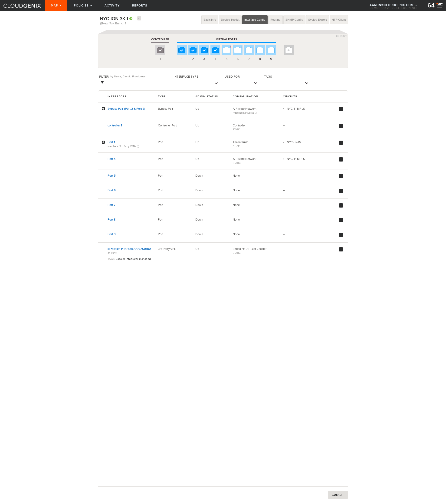
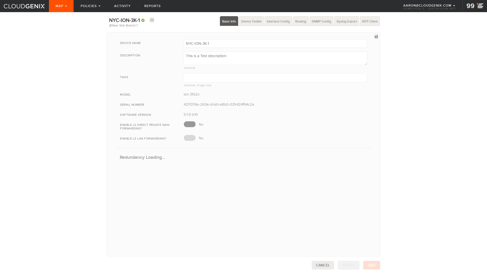
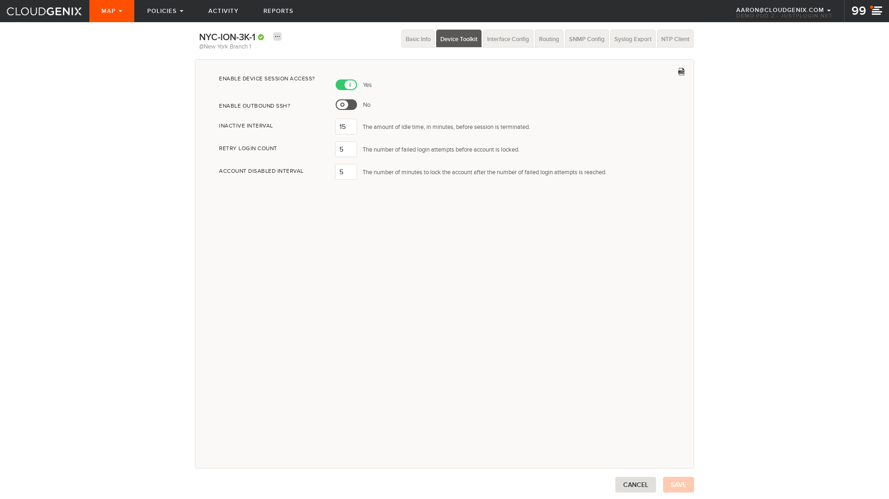
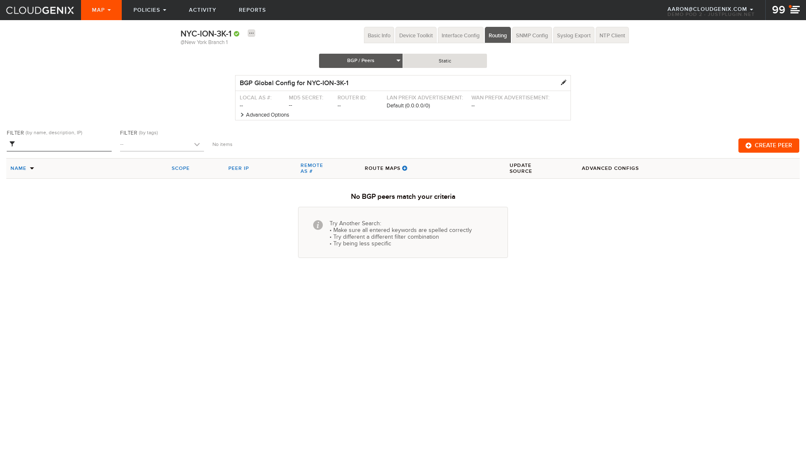
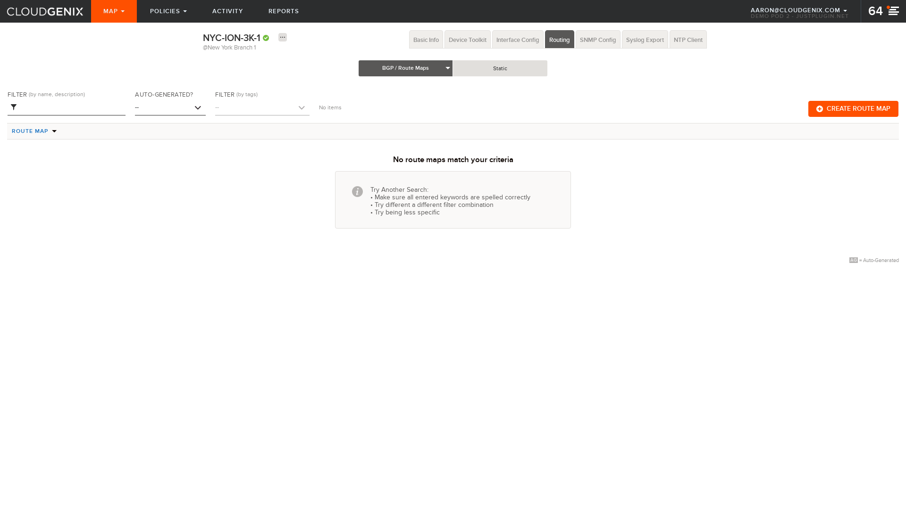
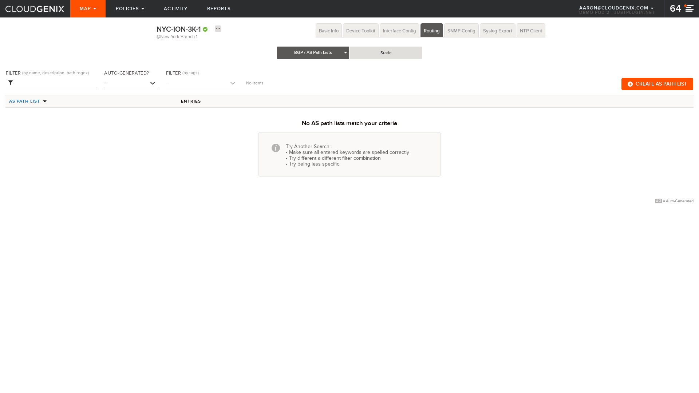
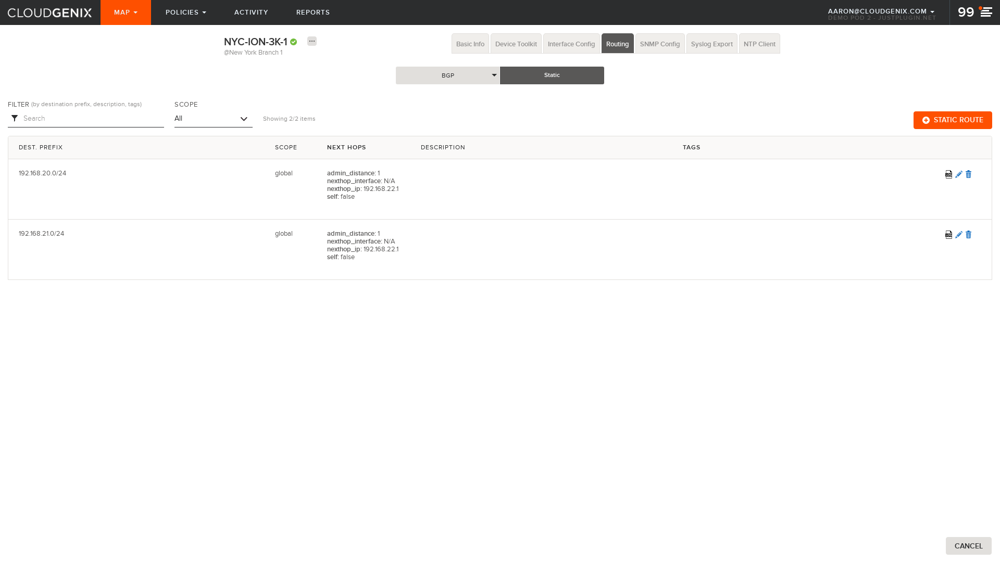
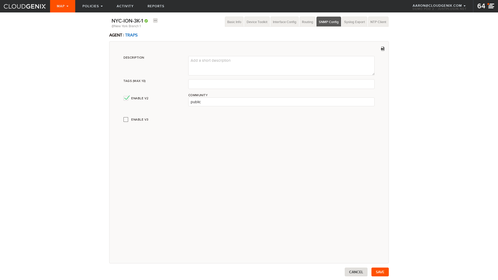
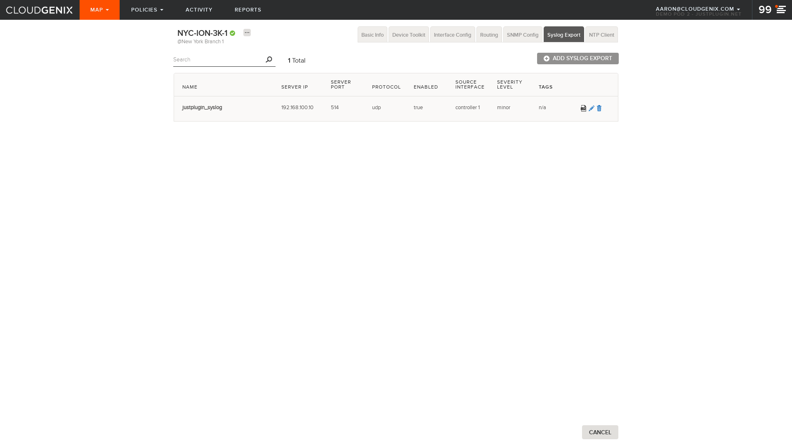
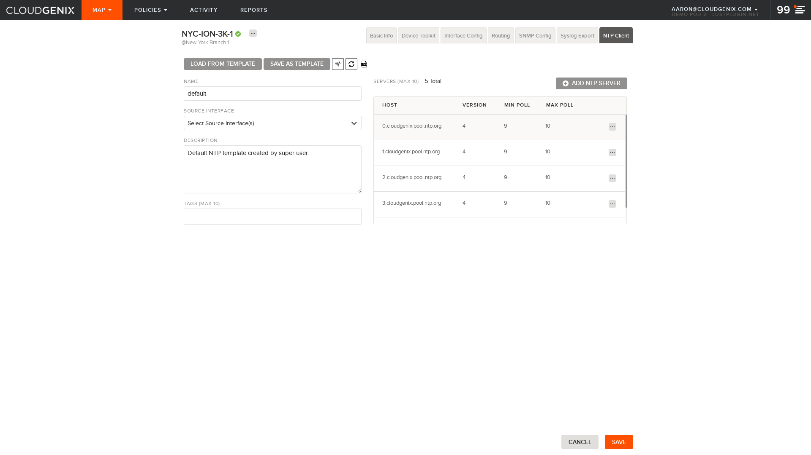

## Element: NYC-ION-3K-1
[Back To Site](../README.md)

### Interfaces
<ul>
<li>
<A href="interfaces/README.md">Interfaces Detail</A>
</li>
</ul>

### Basic Info

### Device Toolkit

### Routing/BGP Peers

### Routing/BGP Route Maps

### Routing/BGP AS-Path Access Lists

### Routing/BGP Prefix Lists

### Routing/BGP Peers

### Routing/Static

### SNMP

### SYSLOG

### NTP

