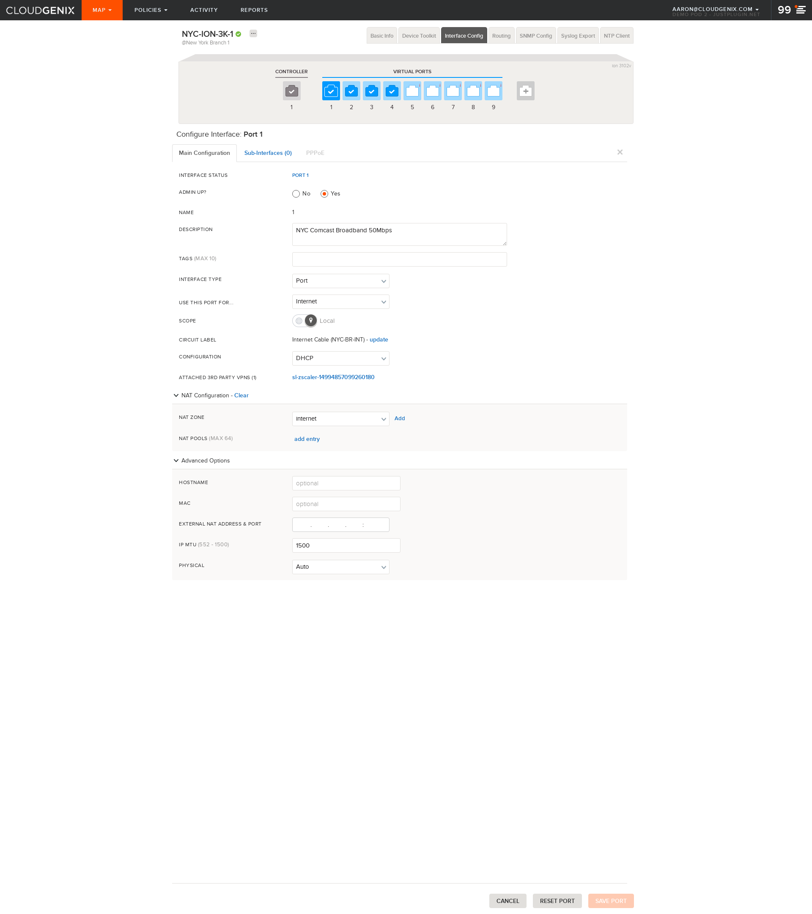
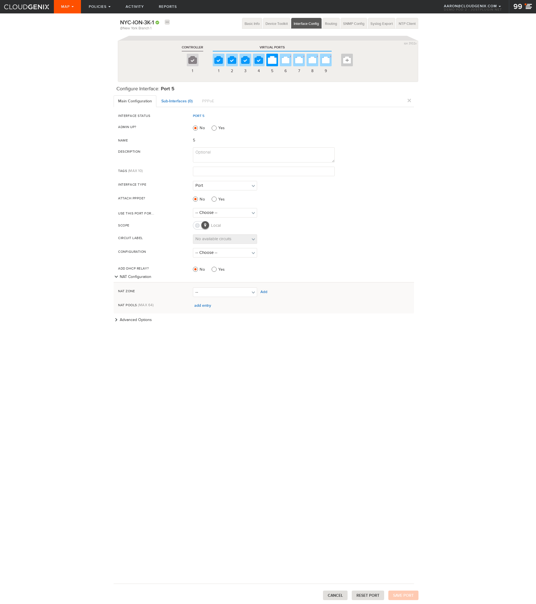
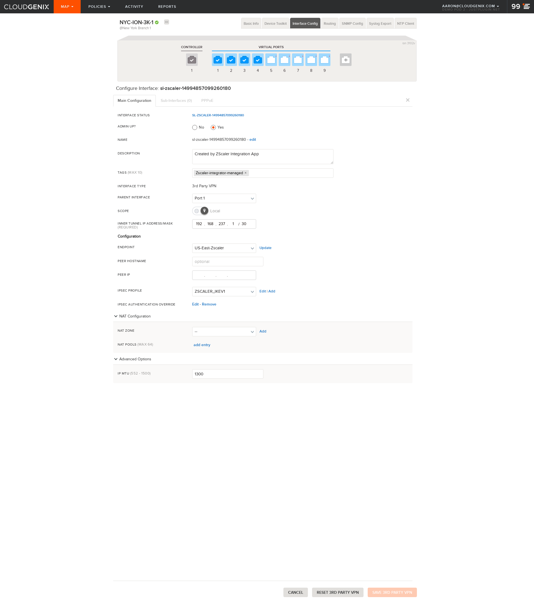

## Element: NYC-ION-3K-1 Interfaces
[Back To Element](../README.md)

### 1

                
### 2

                
### 3

                
### 32

                
### 4

                
### 5

                
### 6

                
### 7

                
### 8

                
### 9

                
### controller 1

                
### sl-zscaler-14994857099260180

                
