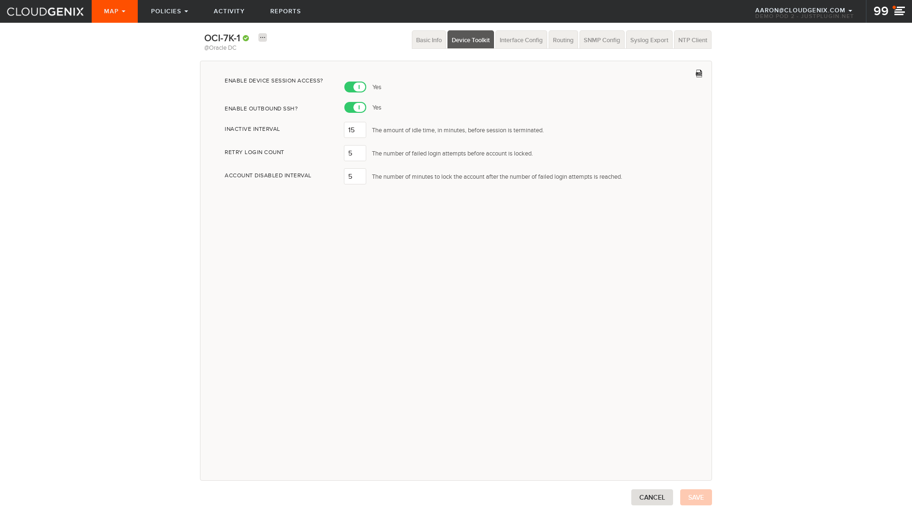
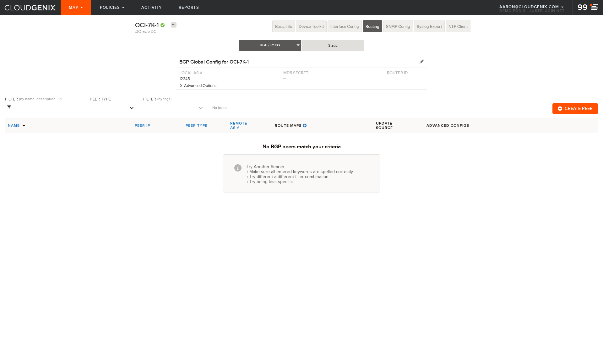
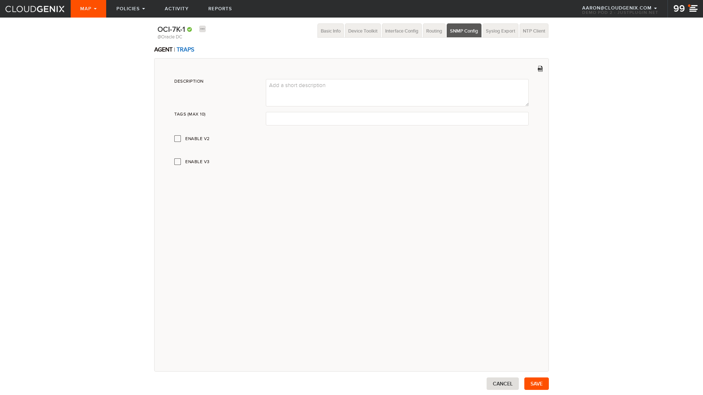

## Element: OCI-7K-1
[Back To Site](../README.md)

### Basic Info

### Device Toolkit

### Interfaces

 - [1](interfaces/1.png)
 - [2](interfaces/2.png)
 - [controller 1](interfaces/controller 1.png)

### Routing/BGP

 - [Route Maps](bgp_route_maps.png)
 - [AS-Path Access Lists](bgp_aspath_acl.png)
 - [Prefix Lists](bgp_prefix_lists.png)
 - [IP Community Lists](bgp_ip_community_lists.png)

### Routing/Static

### SNMP

### SYSLOG

### NTP

